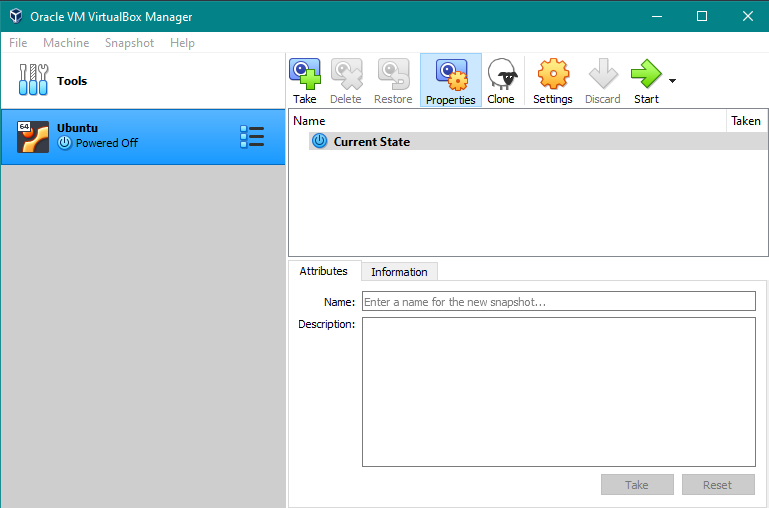
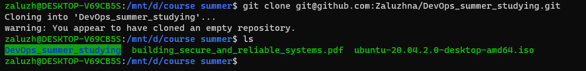
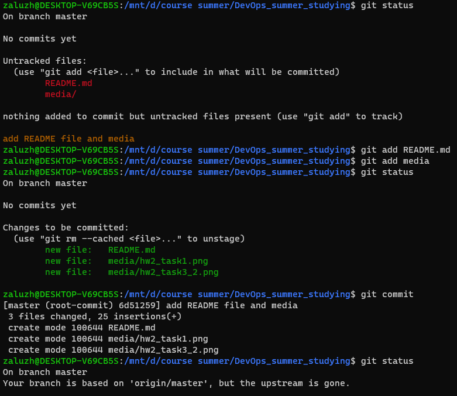
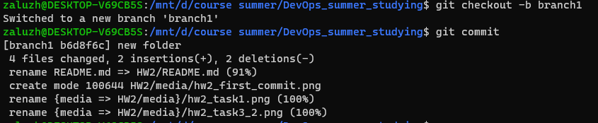
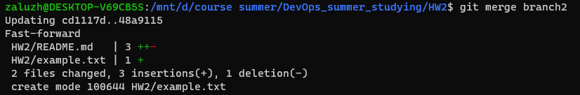

# Home Work № 2
---
06.07.2021
### 1. Installing Linux distribution
I installed Ubuntu 20.04.2.0 on Oracle VM VirtualBox. Also, later there was installed git. \
\
But as result, I find WSL more comfortable in use (which I already had). So, everything next are done there using [this app](https://www.microsoft.com/store/productId/9N0DX20HK701), which I think is amazing to work with.
### 2. Reading "Pro Git" [Chapter 4](https://git-scm.com/book/en/v2)
### 3. On GitHub:
1. **Create a repo on GitHub**
Was created this repo. \
2. **Connect to it by SSH key**

 \
3. **Create several branches on the repositories and create their connection:** \
_master-> branch1-> branch2_ \

\
\
4. **Make committees in the master and branches** \
5. **Combine branch2 into branch1; branch1 into master.** \
\
6. **Try to cause and resolve the merger conflict**

> Recommended for watch: \
[Git Tutorial for Beginners](https://www.youtube.com/watch?v=DVRQoVRzMIY)\
[Git Internals](https://www.youtube.com/watch?v=P6jD966jzlk)\
[Advanced Git Tutorial](https://www.youtube.com/watch?v=0SJCYPsef54)

