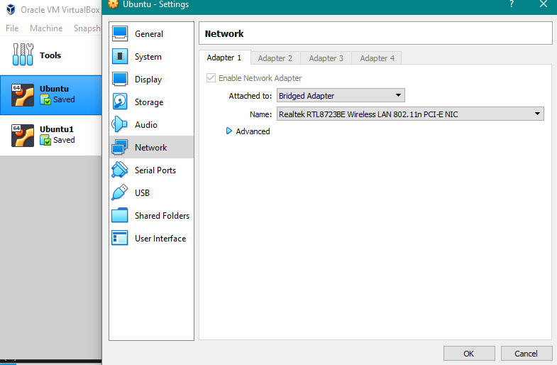
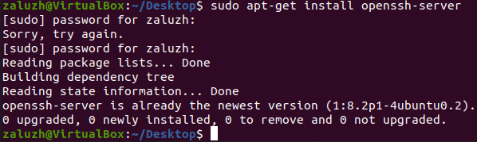
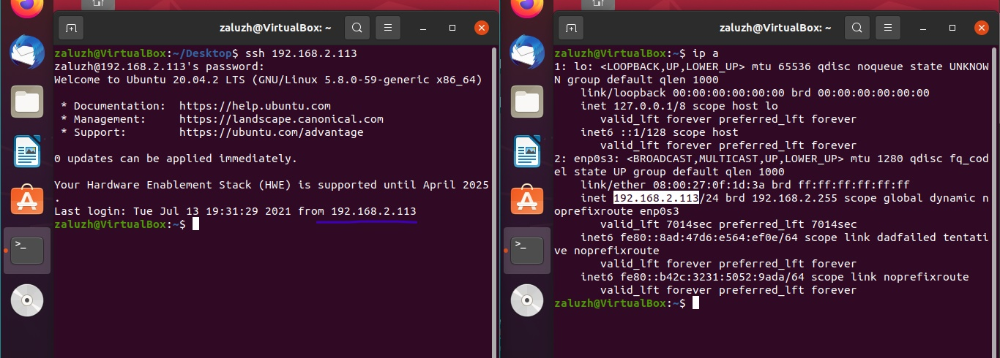
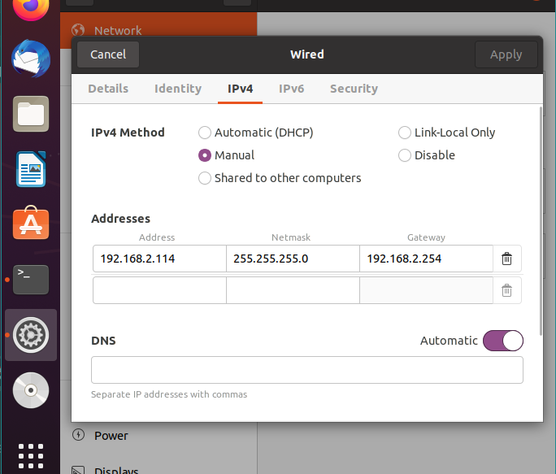
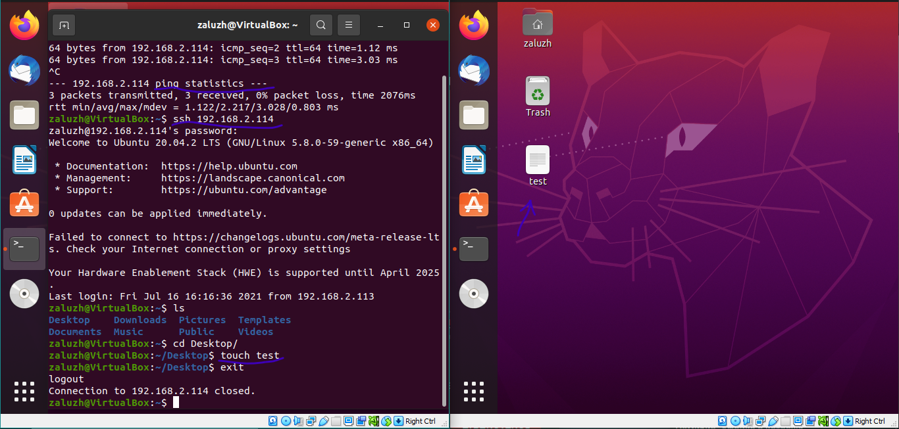
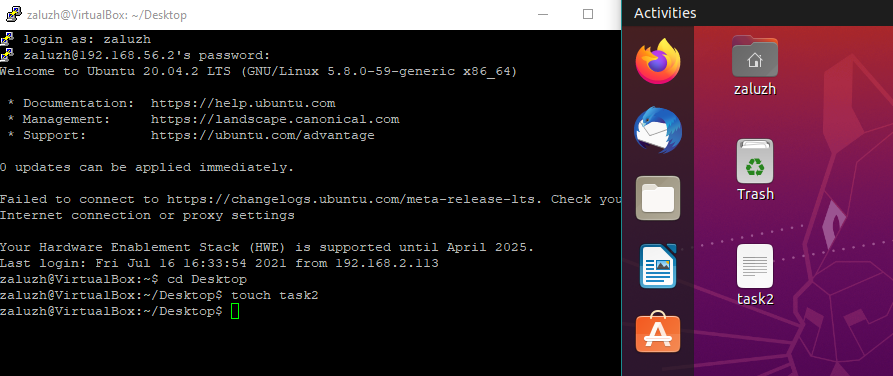

# Home Work № 2.5
---
13.07.2021
### 1. Connect 2 VB 
Налаштування на обох VB  

  
Встановлення ssh-server (там вже було, це для сркіншоту)  

  
Начебто відбулося з'єднання, але по суті я не була на іншій машині (пробний файл створювався не на тій, що треба). В них однакові ip (це копії), тому довелося змінити.  
  
  
Результат з'єднання  

  

### 2. Connection VB-host
Через Putty  
  
