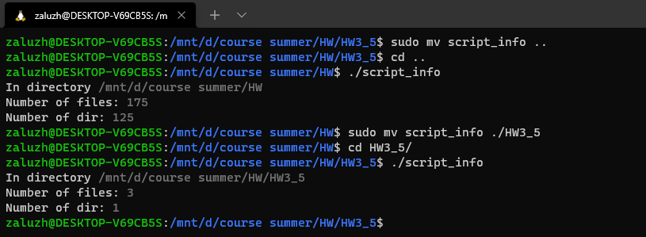

## Home Work № 3.5
---  
20.07.2021  

**Написати свій скрипт, запушити його у гіт (скрипт повинен спрацювати при cкачуванні на інший убунту хост).**  
  
``` bash
#!/bin/bash

DGRAY='\033[1;30m'
NC='\033[0m'

d=$(/bin/pwd)
echo -e "${NC}In directory ${DGRAY}$d"

f=$(find . -type f 2> /dev/null | wc -l)
echo -e "${NC}Number of files: ${DGRAY}$f"

d=$(find . -type d 2> /dev/null | wc -l)
echo -e "${NC}Number of dir: ${DGRAY}$d"

exit
```  

  
  
**Розглянути $PATH**  

  