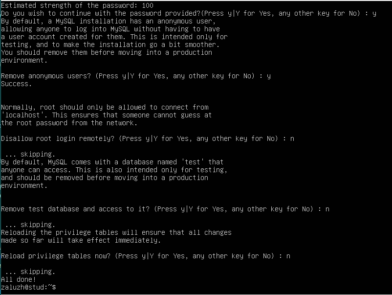
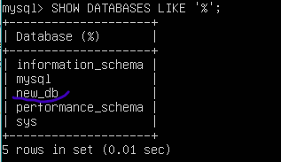

## Home Work № 4
---  
23.07.2021  

##### Зробити шаблон для серверу з LAMP  
  
Використані команди: 
1. Установка LAMP-серверу
``` 
$ sudo apt install php-mysql libapache2-mod-php mysql-server 
```  
2. Перезагрузка. 
```
$ reboot
```
3. Вмикання автозапуску MySQL і Apache
```
$ sudo systemctl enable --now mysql  
$ sudo systemctl enable --now apache2 
```  
**_systemctl_** _- команда управління службами, яка використовує unit-файли з каталогу /etc/systemd/system._  
**_enable_** _- вмикає автозапуск._  
**_- - now_** _- для негайного виконання запуску без очікування перезагрузки_  
4. Налаштуання бази данних, безпечне встановлення.   
```
$ sudo mysql_secure_installation
```  
  
5. Підключення до MySQL.    
```
$ sudo mysql -u root -p  
```  
6. Створення нової бази данних.  
``` mysql
mysql: CREATE DATABASE new_db;
```  
  
7. Створення нового користувача.   
``` mysql
mysql: CREATE USER `<name>`@`<host>` IDENTIFIED WITH mysql_native_password BY '<password>';  
```  
8. Надання новому користувачу привілегій.  
``` mysql
mysql: GRANT ALL ON new_db. * TO `ndbadmin` @`localhost`;  
mysql: FLUSH PRIVILEGES;
```  
9. Створювання скрипту PHP /var/www/html/php-mysql-connect.php для підключення до локальної бази данних.  
``` 
$ cd /var/www/html/
$ sudo vi php-mysql-connect.php  
```  
``` php  
<?php
  $conn = new mysqli("localhost", "<user name>", "<password>", "<database name>");
  
  if ($conn->connect_error) {
    die("ERROR: Unable to connect: " . $conn->connect_error);
  } 

  echo 'Connected to the database.';

  $conn->close();
?>
```  
10. Надання права execute файлу.
```
$ sudo chmod +x . php-mysql-connect.php
```
  
  Далі або щось неправильно написано, або я просто не знаю, як це все перевірити. Браузер ж не показує сторінки на Ubuntu server.  
  Розбираюся.  
